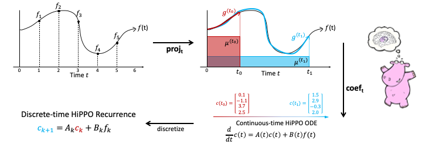

# HiPPO

> **HiPPO: Recurrent Memory with Optimal Polynomial Projections**\
> Albert Gu*, Tri Dao*, Stefano Ermon, Atri Rudra, Christopher Ré\
> Stanford University\
> Paper: https://arxiv.org/abs/2008.07669


> **Abstract.** A central problem in learning from sequential data is representing cumulative history in an incremental fashion as more data is processed. We introduce a general framework (HiPPO) for the online compression of continuous signals and discrete time series by projection onto polynomial bases. Given a measure that specifies the importance of each time step in the past, HiPPO produces an optimal solution to a natural online function approximation problem. As special cases, our framework yields a short derivation of the recent Legendre Memory Unit (LMU) from first principles, and generalizes the ubiquitous gating mechanism of recurrent neural networks such as GRUs. This formal framework yields a new memory update mechanism (HiPPO-LegS) that scales through time to remember all history, avoiding priors on the timescale. HiPPO-LegS enjoys the theoretical benefits of timescale robustness, fast updates, and bounded gradients. By incorporating the memory dynamics into recurrent neural networks, HiPPO RNNs can empirically capture complex temporal dependencies. On the benchmark permuted MNIST dataset, HiPPO-LegS sets a new state-of-the-art accuracy of 98.3%. Finally, on a novel trajectory classification task testing robustness to out-of-distribution timescales and missing data, HiPPO-LegS outperforms RNN and neural ODE baselines by 25-40% accuracy.

## Setup

### Requirements
This repository requires Python 3.7+ and Pytorch 1.4+.
Other packages are listed in `requirements.txt`


## Experiments

Launch experiments using `train.py`.

Pass in `dataset=<dataset>` to specify the dataset, whose default options are specified by the Hydra configs in `cfg/`. See for example `cfg/dataset/mnist.yaml`.

Pass in `model.cell=<cell>` to specify the RNN cell. Default model options can be found in the initializers in the model classes.

The following example command lines reproduce experiments in Sections 4.1 and 4.2 for the HiPPO-LegS model. The `model.cell` argument can be changed to any other model defined in `model/` (e.g. `lmu`, `lstm`, `gru`) for different types of RNN cells.

### Permuted MNIST

```
python train.py runner=pl runner.ntrials=5 dataset=mnist dataset.permute=True model.cell=legs model.cell_args.hidden_size=512 train.epochs=50 train.batch_size=100 train.lr=0.001
```

### CharacterTrajectories

See documentation in `datasets.uea.postprocess_data` for explanation of flags.

100Hz -> 200Hz:
```
python train.py runner=pl runner.ntrials=2 dataset=ct dataset.timestamp=False dataset.train_ts=1 dataset.eval_ts=1 dataset.train_hz=0.5 dataset.eval_hz=1 dataset.train_uniform=True dataset.eval_uniform=True model.cell=legs model.cell_args.hidden_size=256 train.epochs=100 train.batch_size=100 train.lr=0.001
```
Use `dataset.train_hz=1 dataset.eval_hz=0.5` instead for 200Hz->100Hz experiment.


Missing values upsample:
```
python train.py runner=pl runner.ntrials=3 dataset=ct dataset.timestamp=True dataset.train_ts=0.5 dataset.eval_ts=1 dataset.train_hz=1 dataset.eval_hz=1 dataset.train_uniform=False dataset.eval_uniform=False model.cell=tlsi model.cell_args.hidden_size=256 train.epochs=100 train.batch_size=100 train.lr=0.001
```
Use `dataset.train_ts=1 dataset.eval_ts=0.5` instead for downsample.

Note that the model cell is called tlsi (short for "timestamped linear scale invariant") to denote a HiPPO-LegS model that additionally uses the timestamps.


### HiPPO-LegS multiplication in C++
To compile:
```
cd csrc
python setup.py install
```
To test:
```
pytest tests/test_legs_extension.py
```
To benchmark:
```
python tests/test_legs_extension.py
```


## Citation
If you use this codebase, or otherwise found our work valuable, please cite:
```
@article{hippo,
  title={HiPPO: Recurrent Memory with Optimal Polynomial Projections},
  author={Albert Gu and Tri Dao and Stefano Ermon and Atri Rudra and Christopher R\'{e}},
  journal={arXiv preprint arXiv:2008.07669},
  year={2020}
}
```
